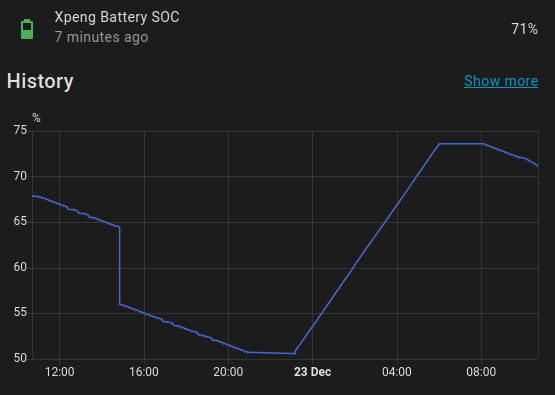
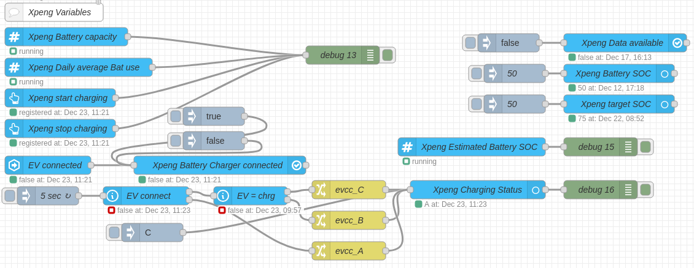
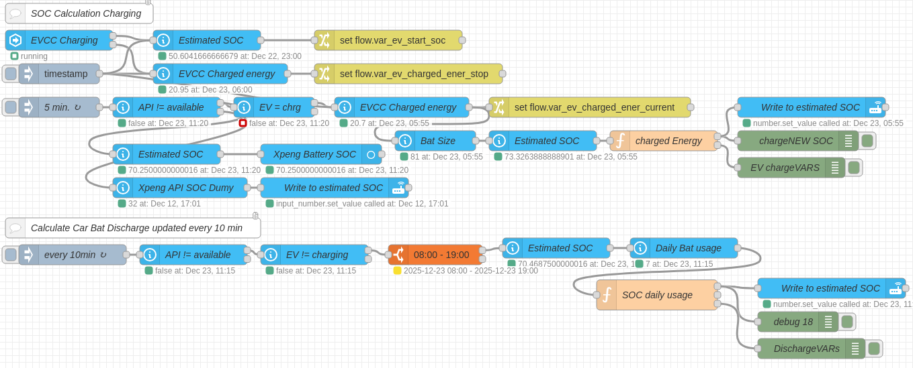
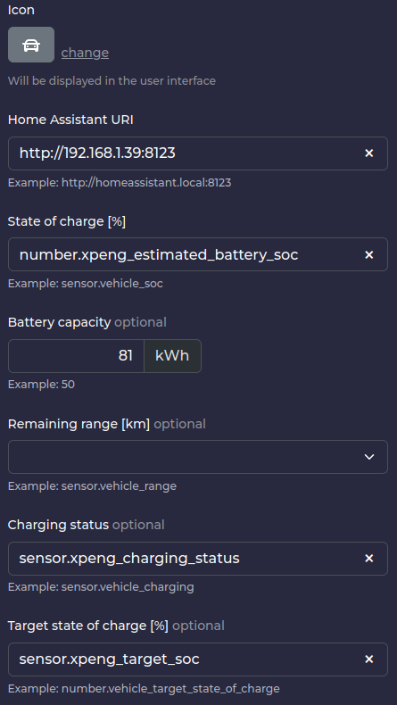

EV Battery SOC Estimation for Node-Red in Home Assistant 🎉️
================================

This flow allows to create a simple system for estimate the current battery SOC of your EV whitch has no functional API notification in Home Assistant quite easily.
to retrieve the SOC from the car. The charged energy is accurate, but the daily consumption is only done with input_number
where you need to determine your average daily battery consumption in percent. As the estimated SOC is input_number too
you can easily manually adjust the SOC to the actual SOC from the car.

You need to have at least an energy meter as a Shelly EM to get accurate estimation during the charging process.
The flows are designed to work with [evcc](https://evcc.io/), an addon to perform solar surplus charging of your EV.
But with some adaptations the flows easily works without having evcc (addon) installed.

I have divided the logic into two different sections to make it more visually understandable.

### evcc/car variable creation (Compagnion Integration)

### Charging / Discharging calculations

To make it work you need to import the two flows into Node-Red and start to adapt the entities for your environment. 

Note: If you are using evcc you need to create a Home Assistant vehicle and link the minimal required entities to evcc.

This is the way of doing it with the UI, which is the preferred method.